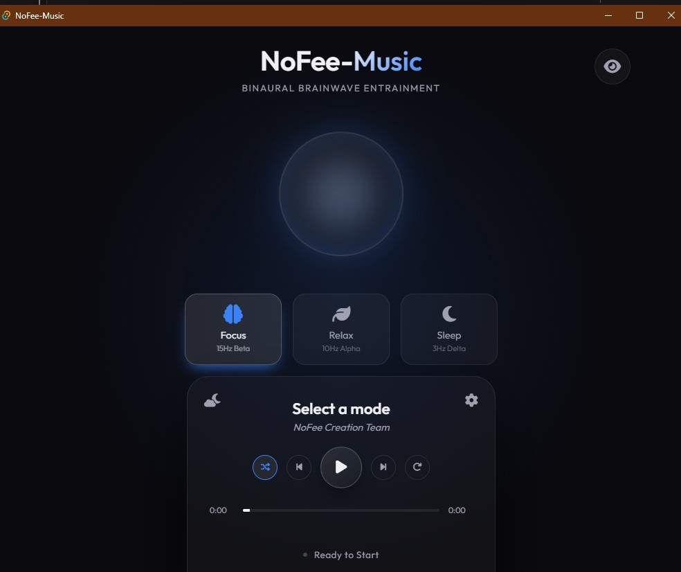
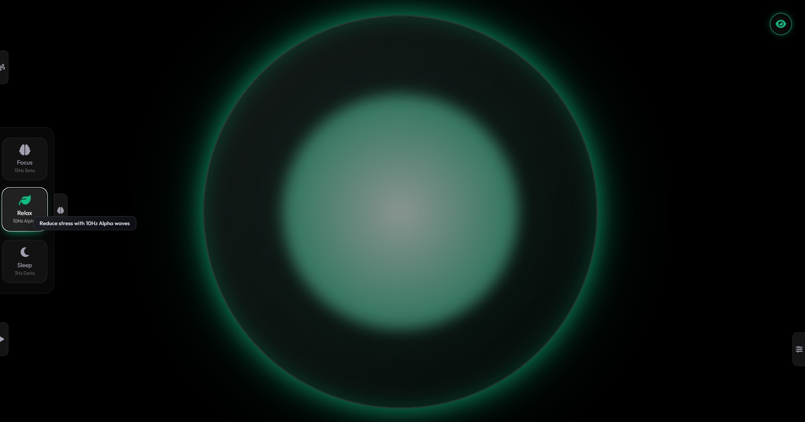
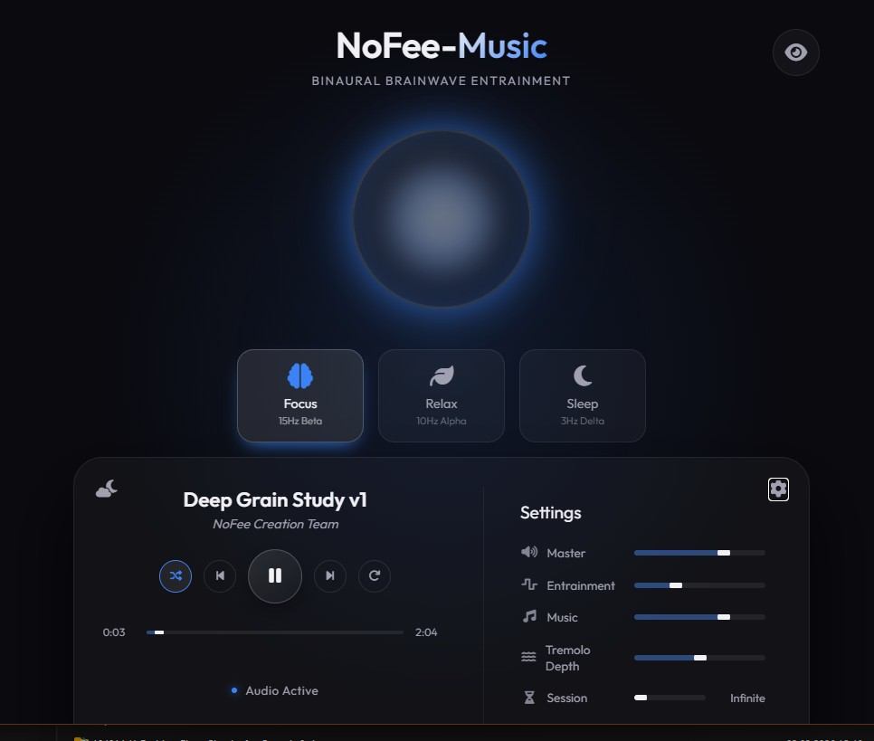

<div align="center">
  <h1>🎧 NoFee-Music</h1>
  <p><strong>Binaural Brainwave Entrainment & Lo-Fi Neural App</strong></p>
  <p>
    
    
    
  </p>
</div>

<br/>

## 🌟 Overview
**Attention: This project is entirely vibe-coded. It is made to be completely offline and thus will not expose your device to anything or sell your soul to the devil, yet I will not hide how this app was made**

**NoFee-Music** is a standalone, fully-offline desktop application designed to enhance your cognitive state using neuromodulation techniques such as binaural beats and amplitude modulation, all seamlessly layered with ambient lo-fi music. 

Built on the lightning-fast **Tauri** framework, this application utilizes the native **Web Audio API** to procedurally synthesize rich sonic environments—meaning no network connections are required, and your data stays 100% private. 

Whether you need to lock in and focus, decompress after a long day, or drift off to a deep sleep, NoFee-Music crafts the perfect auditory atmosphere for your mind.

---

## ✨ Features

- **🧠 Specialized Neural Modes**
  - **Focus:** 15Hz Beta waves to enhance concentration and productivity.
  - **Relax:** 10Hz Alpha waves to reduce stress and induce a calm flow state.
  - **Sleep:** 3Hz Delta waves for deep restorative rest.
- **🌧️ Procedural Ambient Synthesizer**
  Synthesize infinite, non-looping ambient environments in real-time. Includes Rain, Thunder, Wind, River, Space, Ocean, and Fire. 
- **♻️ Smart Cycle**
  Automatically cycle and crossfade through different ambient environments, providing a dynamic, ever-changing backdrop without needing to change settings.
- **🎛️ Total Audio Control**
  Fine-tune the experience with dedicated depth controls for Entrainment intensity, Tremolo depth, Music levels, and Master volume.
- **⏱️ Sleep Timer / Session Time**
  Built-in session tracking and an auto-stop timer, ensuring you can fall asleep peacefully without leaving the app running all night.
- **👁️ Hypnotize Mode**
  A full-screen, distraction-free visual experience with a reactive UI.
- **🔒 Fully Offline & Secure**
  No required network requests, no accounts, and no logging. The entire audio engine runs natively on your machine.

---

## 🛠️ Technology Stack

- **Frontend Application Core**: Vanilla JavaScript, HTML5, and CSS3. 
- **Audio Engine**: Web Audio API (for procedural synthesis and entrainment generation)
- **Desktop Wrapper**: [Tauri](https://tauri.app/) (Rust)
- **Design System**: Responsive glassmorphism UI with FontAwesome Icons & Google Fonts.

---

## 🚀 Getting Started
### 🎧 I want to just use this!

Head on over to the [releases](https://github.com/norgur/NoFee/releases) page and download the latest release for your platform.
"Your platform" means Windows for now but I'm working on adding more.

### Prerequisites
To build the application from source, you must have the following installed:
- [Rust](https://www.rust-lang.org/tools/install)
- [Node.js](https://nodejs.org/en/) & `npm` (if any frontend dependencies are added)
- Platform-specific build tools for Tauri (e.g., MSVC on Windows, Xcode on macOS)

### Installation & Build

1. **Clone the repository**
   ```bash
   git clone https://github.com/yourusername/nofee-music.git
   cd nofee-music
   ```

2. **Run carefully natively**
   To run NoFee-Music locally for development without compiling the final executable:
   ```bash
   # Navigate to the tauri directory (if necessary depending on setup)
   cd src-tauri
   cargo tauri dev
   ```

3. **Build the Release Executable**
   ```bash
   cargo tauri build
   ```
   The generated executables will be located under `src-tauri/target/release/bundle/`.

---

## 📸 Screenshots
<p>




</p>

---

## 🤝 Contributing

Contributions are always welcome! Since NoFee-Music relies heavily on the native Web Audio API, we're particularly interested in pull requests that add new synthesized ambient sounds, visualizer improvements, and performance optimizations.

1. Fork the Project
2. Create your Feature Branch (`git checkout -b feature/AmazingFeature`)
3. Commit your Changes (`git commit -m 'Add some AmazingFeature'`)
4. Push to the Branch (`git push origin feature/AmazingFeature`)
5. Open a Pull Request

---

## 📝 License

Distributed under the GPL 2.0 License. See `LICENSE` for more information.

<br/>
<div align="center">
  <p><i>Crafted for focus, relaxation, and better sleep. 🌙</i></p>
</div>
